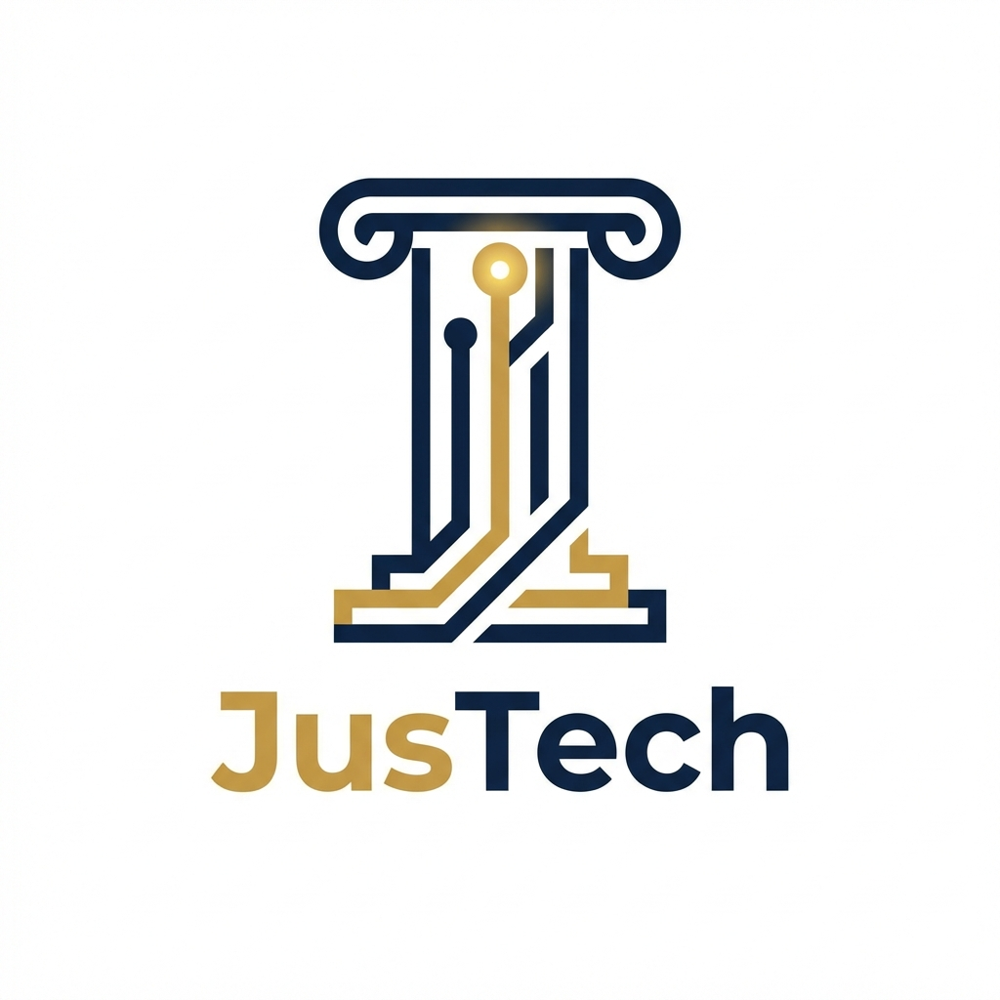

# 🏛️ JusTech DAO

> **Democratizando a Automação Jurídica através da Descentralização.**

## 📜 Nossa Missão
A **JusTech DAO** é uma organização autônoma descentralizada dedicada a financiar, desenvolver e manter ferramentas *open-source* para automação jurídica. 

Acreditamos que o acesso à tecnologia jurídica de ponta (LegalTech) não deve ser privilégio de grandes escritórios. Nossa comunidade une desenvolvedores, advogados e entusiastas para construir o "Sistema Operacional Jurídico Aberto".

## 🚀 Como Funciona
A DAO opera através de propostas comunitárias financiadas pelo nosso tesouro.
1.  **Ideação**: Membros propõem novas ferramentas (ex: "Bot de triagem de processos", "Gerador de contratos via IA").
2.  **Votação**: Detentores do token `$JUS` votam na aprovação do projeto via Snapshot.
3.  **Execução**: Desenvolvedores recebem *bounties* (recompensas) para entregar o código.
4.  **Distribuição**: O software é liberado para a comunidade sob licença MIT.

## 🛠️ Stack Tecnológica & Ferramentas
Utilizamos as ferramentas padrão-ouro da Web3 para governança:

| Área | Ferramenta | Função |
| :--- | :--- | :--- |
| **Comunicação** | **Discord** | Chat oficial, calls semanais e suporte. |
| **Governança** | **Snapshot** | Votação *gasless* (sem taxas) para propostas. |
| **Tesouro** | **Gnosis Safe** | Carteira Multi-Sig para segurança dos fundos. |
| **Fórum** | **Discourse** | Debates aprofundados sobre propostas (JIPs - JusTech Improvement Proposals). |
| **Pagamentos** | **Utopia** | Gestão de folha de pagamento e bounties. |

## 💎 O Token $JUS
O token de governança `$JUS` confere poder de voto e acesso a recursos premium.
*   **Total Supply**: 100.000.000 JUS
*   **Recursos**: Votação, Staking para recompensas, Acesso antecipado a betas.
*   [Leia o Tokenomics completo aqui](./TOKENOMICS.md)

## ⚖️ Governança
Nossa estrutura é democrática e transparente. Qualquer membro com mais de 1.000 $JUS pode submeter uma proposta.
*   [Leia as Regras de Governança](./GOVERNANCE.md)
*   [Whitepaper do Projeto](./WHITEPAPER.md)

## 🤝 Roadmap 2026
- [x] **Q1**: Lançamento do Whitepaper e Comunidade Discord.
- [ ] **Q2**: Primeira rodada de financiamento de ferramentas N8n.
- [ ] **Q3**: Lançamento da plataforma de templates jurídicos.
- [ ] **Q4**: Integração com Tribunais (API pública).

---
*Construído com ❤️ pela comunidade JusTech.*
